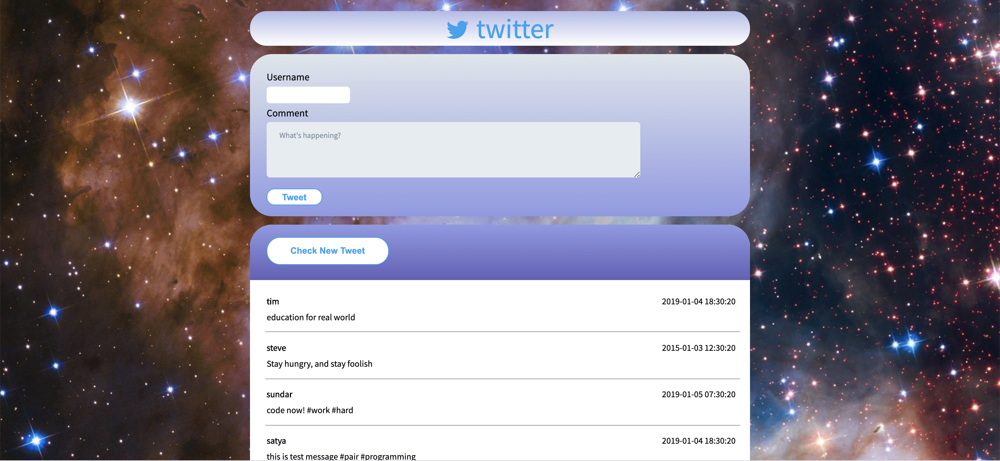
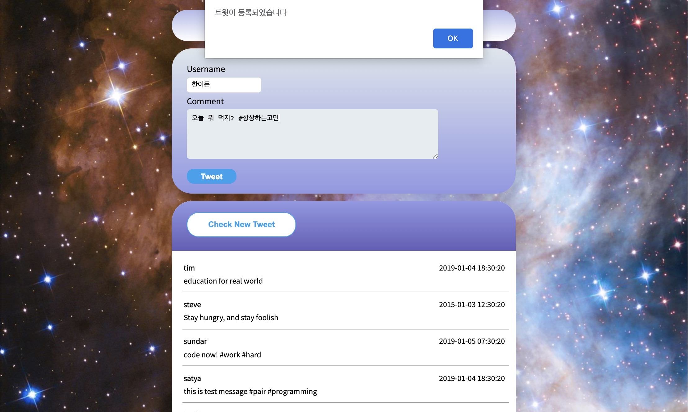
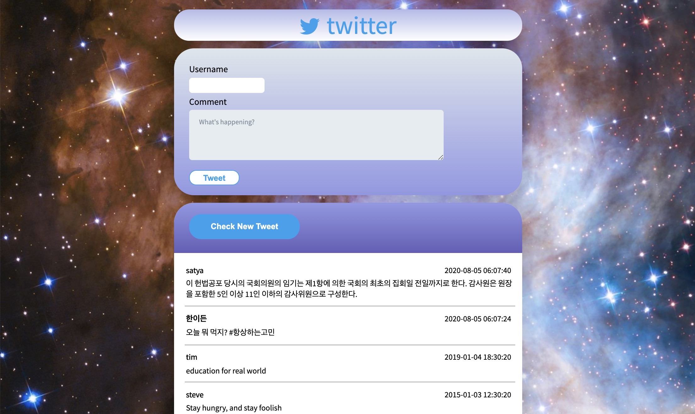
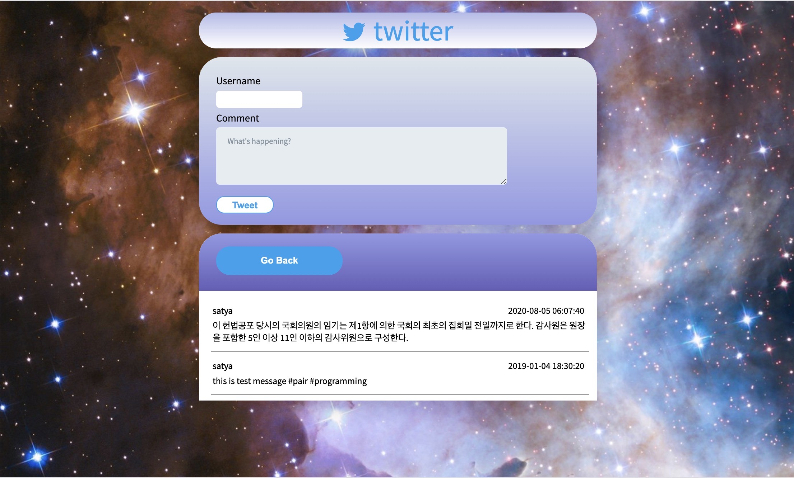

# twittler

This is a copy of the work I did on a private repo, originally a project, which is actually a very first time i worked on, from Code States' curriculum. It was created with using HTML, CSS and Javascript DOM.

## DEMO

# 

# 

# 

# 

## Author

- [Iden Han](https://idenhan.tistory.com/)

## Technologies

- HTML
- CSS
- JAVASCRIPT DOM
